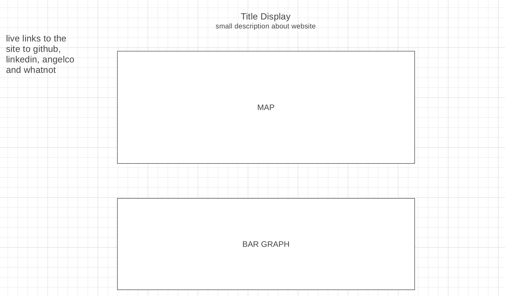

# Covid, by the numbers

## Background
+ Covid by the numbers is a website used to track covid related data, such a daily new cases and number of deaths per state.

## Functionality and MVPs
+ Map represents each state and new cases per day via color gradient. Legend serves as a scale.
+ Users can hover over a state and see tooltip display statistics
+ There will be a bar graph to show relevant data below alongside with a states party affiliation according to the 2020 election (Thinking of two modes between number of deaths and new cases that will render data respectively) 

## Technologies
+ Javascript
+ D3
+ HTML
+ CSS

## Wireframe

## Timeline
+ Day 1: Researching state/party affiliation, poll data to show percentage of voters that believe in wearing a mask
+ Day 2: Learn D3.js and how to make charts to visualize data
+ Day 3: Continue working with D3.js to implement different chart styles for different types of data
+ Day 4: Work on UI of page and implement intended functionality to all features
+ Day 5: Finish up any remaining MVPs and work through any lingering bugs
